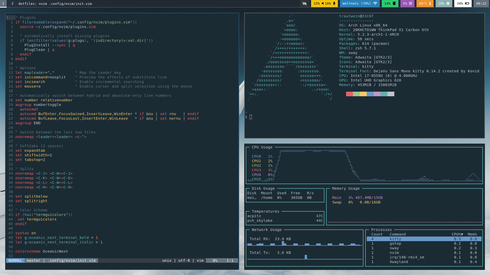

# dotfiles
## Screenshot


## Makepkg configuration
Speed up `makepkg` by configuring it to use all available cores during compilation (`-j$(nproc)`) and compression (`-T0`) as well as using xz with the least aggressive compression preset level (`-0`).

> /etc/makepkg.conf
```bash
MAKEFLAGS="-j$(nproc)"
COMPRESSXZ=(xz -c -z - -0 -T0)
PKGEXT='.pkg.tar.xz'
SRCEXT='.src.tar.xz'
```
## Font configuration
### Install Fonts
```zsh
sudo pacman -S ttf-dejavu ttf-liberation noto-fonts
```

### Enable font presets
```zsh
sudo ln -s /etc/fonts/conf.avail/70-no-bitmaps.conf /etc/fonts/conf.d
sudo ln -s /etc/fonts/conf.avail/10-sub-pixel-rgb.conf /etc/fonts/conf.d
sudo ln -s /etc/fonts/conf.avail/11-lcdfilter-default.conf /etc/fonts/conf.d
```

### Font configuration
> /etc/fonts/local.conf
```xml
<?xml version="1.0"?>
<!DOCTYPE fontconfig SYSTEM "fonts.dtd">
<fontconfig>
  <match>
    <edit mode="prepend" name="family"><string>DejaVu Sans</string></edit>
  </match>
  <match target="pattern">
    <test qual="any" name="family"><string>serif</string></test>
    <edit name="family" mode="assign" binding="same"><string>DejaVu Serif</string></edit>
  </match>
  <match target="pattern">
    <test qual="any" name="family"><string>sans-serif</string></test>
    <edit name="family" mode="assign" binding="same"><string>DejaVu Sans</string></edit>
  </match>
  <match target="pattern">
    <test qual="any" name="family"><string>monospace</string></test>
    <edit name="family" mode="assign" binding="same"><string>DejaVu Sans Mono</string></edit>
  </match>
</fontconfig>
```
